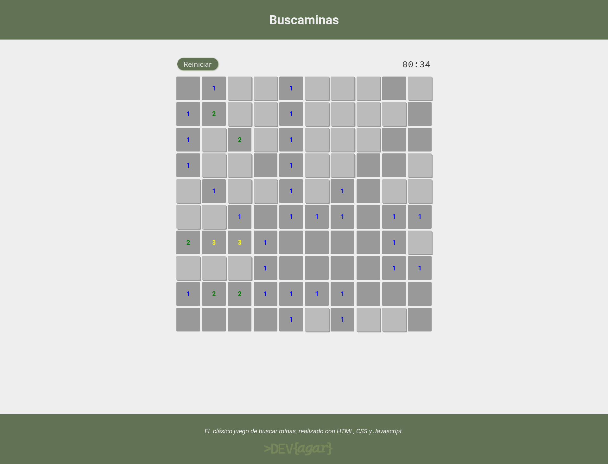

# Buscaminas

Este es un juego de buscaminas simple, implementado utilizando HTML, CSS y JavaScript.

## Descripción

El juego de buscaminas es un clásico juego de mesa en el que el jugador debe despejar un campo minado sin hacer explotar ninguna mina. El objetivo es revelar todas las casillas del tablero que no contienen minas.

## Captura de pantalla

## Cómo jugar

Entra en: (https://devagargz.github.io/buscaminas/){:target="_blank"}

1. Haz clic en las casillas para revelarlas.
2. Si haces clic en una mina, el juego termina.
3. Si descubres todas las casillas sin minas, ¡has ganado!

## Personalización

Siéntete libre de modificar el código para agregar nuevas características o personalizar la apariencia del juego.

## Contribuciones

Las contribuciones son bienvenidas. Si encuentras algún error o tienes alguna sugerencia de mejora, por favor, abre un issue o envía un pull request.

## Créditos

Este juego fue creado por [DEVagar](https://devagar.dev).